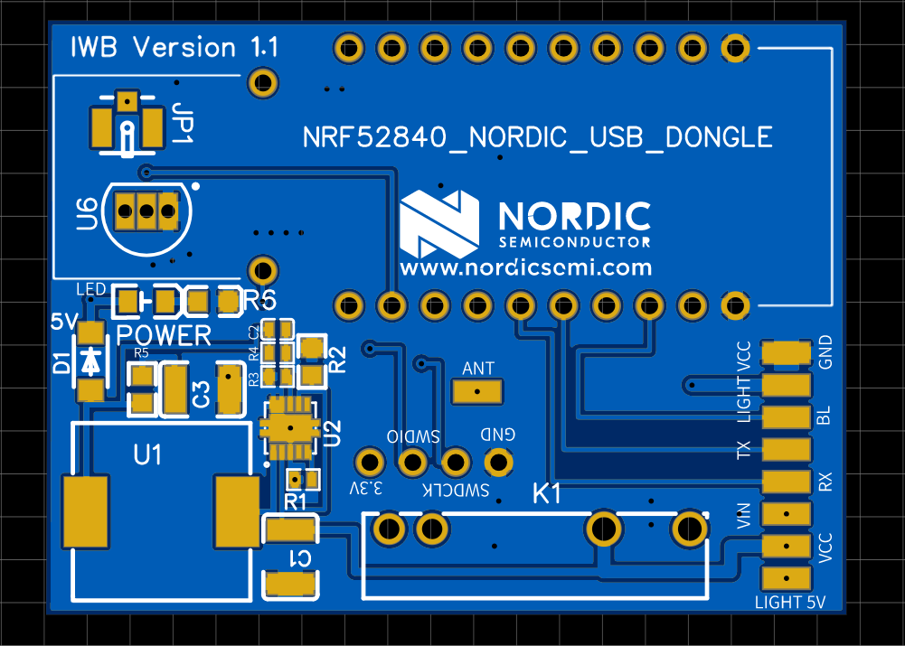
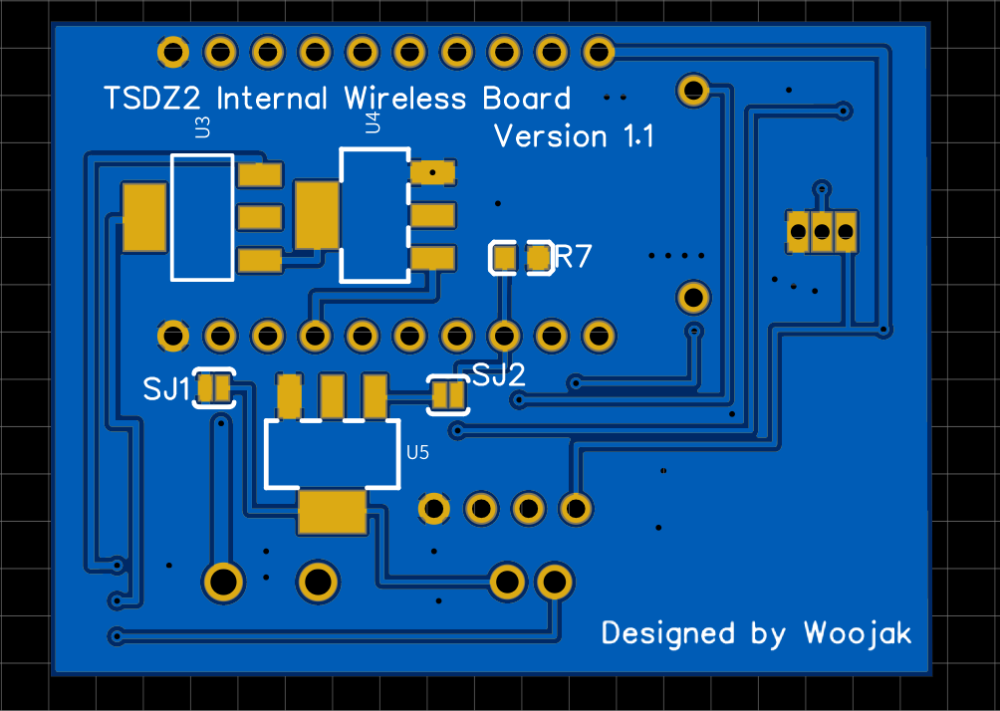

<b>Design inspired by the 
 **[TSDZ2 Wireless Project](https://opensourceebike.github.io/)**
 by **[Casainho](https://endless-sphere.com/forums/memberlist.php?mode=viewprofile&u=18879).**</b>
 
 

Hello. 
In my spare time, I finally managed to design an internal PCB  
based on the TSDZ2 EBike Wireless Controller with some small additions  :)  
I added Relay for lights with a voltage higher than 5V  
(you can choose whether it should be controlled from nRF or from the motor controller), solder pads  
for the temperature sensor and Ufl connector for an external antenna. 
 
 
Unfortunately, in order to connect it, I plan to slightly modify the nRF. 
(**[link](https://devzone.nordicsemi.com/f/nordic-q-a/58983/nrf52840-dongle-matching-network-for-ext-antenna)**)  

 
I am not only sure if the PCB dimensions will be perfect, unfortunately I am waiting  
for a spare controller and I do not want to disassemble the engine :)  
 
 
version 1.2: 
Change from internal 5V inverter to external <a href="https://export.rsdelivers.com/product/xp-power/sth0548s05/xp-power-surface-mount-dc-dc-switching-regulator/1883365" target="_blank">XP Power STH0548S05</a>.
 
 

 

I hope people will like the project! 
I am also waiting for constructive criticism, maybe someone will manage to notice some error for which I will be able to fix!  
 
Link created in EasyEDA 
link: 
https://easyeda.com/woojak666/tsdz2-wireles-board_copy  
 
 
 
jumpers "SJ1" "SJ2", you can select the signal
source for the light switch (by default not selected)

Soldered "SJ1" - 5v signal from the controller
Soldered "SJ2" - signal from nRF52840 (P0.17)

temperature sensor: LM35CZNOPB (P0.15)

external antenna:
2.4GHZ (50ohm internal resistance)
 
Version 1.1

 
 
Version 1.2

 
 

nRF Adaptive Board: 
Minimalist PCB board to assemble **[DIY EBike wireless controller](https://opensourceebike.github.io/ebike_wireless_controller.html).** 
 
 

 
 
 
 

 
 
 
 

 
 
 
 

 
 
The PCB board has not been assembled by me yet.
I am currently waiting for delivery.

